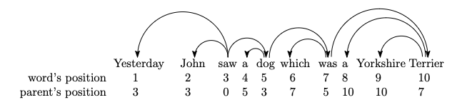

# ProText project - the relation between syntactic dependencies and pauses

This repository contains input and output data, as well as Python code used to explore the relation between syntactic dependencies and pauses made when typing text. 

## Input data

The input data consists of `.conll` files which contain the in `misc` column the pause in seconds made after each character of the word whose morpho-syntactic characteristics are described on that line. 

The input data consists of the following folder containing `.conll` files:
- `data/Pro-TEXT_annotated_corpus_v0.3/conllu_files` : files with character indexes, as well as information on whether the character is present in the final version of the text (present as True/False value for each character) in the misc column, but without pauses
- `data/Pro-TEXT_annotated_corpus_v0.3/conll_with_pauses` : similar to files in `conllu_files` but with pauses in seconds addded after each character

The particularity of this data is that the sentences are a representation of the typing process. so each new sentence is a repetition of the previous one with an added token, as exemplified below:

>sentence_id=1, text_version=1: This
>
>sentence_id=1, text_version=2: This is
>
>sentence_id=1, text_version=3: This is a
>
>sentence_id=1, text_version=4: This is a test

More specifically, in the .conll files the field sentence_id keeps track of the whole final sentence, while text_version keeps track of the order of modifications. 

Note that in this simplified example tokens were added from one text version to the next, but in the real examples tokens or even only characters could be deleted as well as added.

The input data needed cleaning before any processing could be attempted due to:
- Inconsistent spacing between sentences (extra empty lines when going from one sentence id to another)
- Inconsistent metadata for each sentence (e.g. sentence_id not present for each sentence, text_version not always incrementing by 1)
- Problematic annotation (e.g. multiple syntactic heads for one sentence)

Small scale cleaning code is in the `test_code/conll_cleaning.ipynb` notebook, and it was implemented for all conll files in the `normalise_conll.py` script. The output of this script is a copy of all input conll files, but with dependencies automatically re-done by using the Stanza library. 

The clean files are in `data/Pro-TEXT_annotated_corpus_v0.3/conll_clean`.

## LAL library 

In order to obtain quantitative information on the syntactic dependencies we have worked with the team developing the LAL library: https://cqllab.upc.edu/lal/ 

Please note that in order to launch any of the scripts mentioned in this section you will need to install this library, using the steps here: https://github.com/LAL-project/linear-arrangement-library

In the `test_code` folder you will find numerous notebooks and scripts that test the functions provided by the lal library on example sentences and files, so it's a good starting point to understanding the basis on which the larger scripts were built.

In order for the LAL library to compute any measures, we need to transform the .conll sentences into head vectors - an array of indexes representing the heads of all the tokens. 

In this example the head vector would be the array [3 3 0 5 3 7 5 10 10 7]. 

Using a text file where every sentence from the .conll files was turned into an array like the one above (`data/outputs/head_vectors.txt`) we calculated the following:
- syntactic measures:
    - proportion of head_initial structures
    - mean hierarchical distance
    - tree diameter
    - number of crossings
    - predicted number of crossings
    - expected number of crossings
    - sum of edge lengths
    - expected sum of edge lengths
    - mean dependency distance
- flux measures
    - size
    - left span
    - right span
    - weight
    - right to left ratio
    - weight to size ratio

The explanation for what each of these measures represents is found in the lal documentation here: https://mydisk.cs.upc.edu/s/AzZAZ6QkjbJXdeN 

Here are the main scripts used to obtain the first results:

- `data_structure.py` : contains a way to deserialise the .conll files and making the information more manageable. 
- `process_conll.py` : takes as input:
    - a folder of clean conll files (`data/Pro-TEXT_annotated_corpus_v0.3/conll_clean`)
    - a file that the head vectors will be written in  (`data/outputs/head_vectors.txt`)
    - a csv that will contain all the syntactic measures calculated using the library (`data/outputs/final_lal_output.csv`)
    - a csv that will contain the fluxes measures (`data/outputs/pause_fluxes.csv`)
    
    The script calculates these measures using the LAL library and then stores them all in the files given as input. Then it calculates a variaty of correlations between each of these measures and the pauses in seconds (Pearson, Kendall Tau, Spearman).

## Statistical processing of results

Due to the complexity of the data, some statistical processing was necessary in order to visualise results and establish connections between the different results.

The calculations that were made are:

- Principal Component Analysis (PCA) on the fluxes measures:  `pca_analysis.ipynb`
- Mixed effects modelling on the pauses vs. size of the flux: `mixed_effect_modelling.ipynb` (the other measures could be easily calculated starting from this script)

The interpretations and explanations on the outputs of this processing are detailed in `results_statistical_analysis.pdf`

Please note only the main scripts were mentioned here. In the repository you will find smaller Jupyter notebooks or python scripts exploring different hypotheses, potential measures, making visual representations of these results and measures or manipulating data to fit with various requirements (all are found in the `notebooks` folder). 

If you have any questions about any of the scripts in this repository feel free to get in touch!